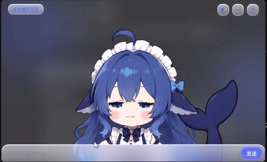
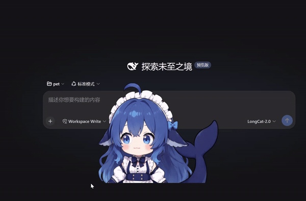

# SeekBuddy · dsh-seekbuddy

**SeekBuddy(仓库名 `dsh-seekbuddy`)** 是 [DeepSeek Harness](https://github.com/deepseek-ai/deepseek-harness)(DSH) 的**桌面宠物对等客户端**——
一只常驻桌面的 Live2D 宠物,既能看着你的 Agent 干活,也能随手指挥它。

它不是"只会动的挂件":SeekBuddy 与 DSH Web GUI **平级、loopback 受信**,可以实时控制并观察 DSH——
盯着会话状态、发消息、批审批,把它当作 Agent 的**迷你常驻控制台**。

---

## 项目亮点

### 1. 自研 Live2D 运行时,不止一张皮

- **自研的部分**:Live2D 渲染与动画运行时(`pet/live2d/`)、可插拔动画器接口(`pet/animator.ts`)、
  XState 语义状态机、动画仲裁/互斥/优先级系统(`AnimationDirector`)。状态机只输出语义状态
  (`idle/thinking/happy/sad/talking`)——换动画后端只需加一个实现类,状态机/事件/UI 零改动。
- **非自制的部分**:角色**形象(立绘/模型资产)**不是本仓库画的,版权归原素材作者(见文末许可)。


### 2. 缩小版的 DSH 客户端,能力对等、常驻桌面

- 复用 DSH 官方给浏览器用的 `/api` + WebSocket 协议(`@deepseek-ai/dsh-host-apiproxy` 与
  `@deepseek-ai/dsh-client-connection`),能执行 Web GUI 能执行的绝大多数操作;
- 用极小的窗口承载完整控制面:对话气泡、输入条、会话雷达、审批/提问卡、设置面板;
- 常驻桌面 + 置顶 + 托盘管理——不必切到完整页面,就能盯着 Agent 干活、发消息、批审批。

---

## 演示

> 下方为 GIF 动图演示。

### 完整界面 / 对话 / 面板



### 窗口拖拽的物理反馈



---

## 特性

- **常驻桌面**:无边框透明 + 置顶 + 不入任务栏(托盘管理),开机自启可选。
- **Live2D 角色**:官方 Cubism SDK + 独立 canvas 自绘;WebGL2 不可用时回落到 PixiJS 几何"球宠"。
- **语义状态机**:`idle / thinking / happy / sad / talking`,动画可插拔、可互斥与优先级打断。
- **对等操控 DSH**:发消息、停止回合、列会话/历史、切换目标会话、审批/提问回执、新建会话。
- **设置面板可调**:透明度、窗口尺寸(边缘拖拽)、极简模式、宠物位置/缩放/跟随手感、瞳孔/拖动反馈、
  思考/睡眠表情阈值、开机自启。
- **配置持久化**:`%APPDATA%/SeekBuddy/config.json`(原子写,损坏兜底默认值;改名自 `DSH Pet` 起会自动迁移旧配置)。
- **预留 Agent → 宠物接口**:内置 MCP server(stdio),已暴露 `pet.setExpression` / `pet.notify` 等
  工具桩;⚠️ "Agent 驱动宠物"的端到端功能尚未完成,当前仅接口存在、不作为特色宣传。

---

## 运行前提

> ⚠️ SeekBuddy **依赖 DeepSeek Harness**,不是一个可独立运行的 app。它需要:

1. **完整的 DeepSeek Harness monorepo**(或含 `@deepseek-ai/dsh-host-apiproxy`、
   `@deepseek-ai/dsh-client-connection` 等 workspace 包的环境)——宠物用 `workspace:^` 引用这些包,必须在该 workspace 内构建。
2. 一个**正在运行的 DSH 实例**,默认连 `http://127.0.0.1:3080`(loopback 受信,与 Web GUI 同级权限)。
3. **不要部署到非 loopback**:宠物的权限来自 loopback 受信,连远端会失去信任边界。

---

## 下载预编译版本（Release）

不想从源码构建？可从 [Releases](https://github.com/lilightspeed/dsh-seekbuddy/releases) 页面下载预编译的 Windows 安装包 / 绿色版，**无需 Node.js / pnpm**：

1. 先在本机启动一个 DSH 实例（宠物不是独立 app，必须连本地 `127.0.0.1:3080`）：
   ```bash
   npx @deepseek-ai/dsh web
   ```
2. 到 [Releases](https://github.com/lilightspeed/dsh-seekbuddy/releases) 下载对应版本的 exe：
   - `SeekBuddy-Setup-<version>.exe` —— NSIS 安装包
   - `SeekBuddy-Portable-<version>.exe` —— 绿色免安装版（解压即运行）
3. 运行 SeekBuddy，它会自动连接 `127.0.0.1:3080`；首次可在设置面板改 `baseUrl`。

> ⚠️ **仅支持 Windows x64**。macOS / Linux 暂无预编译包，需从源码在各自平台构建（见下文）。
> ⚠️ 自带的鲸鱼娘形象为 **CC BY-NC-SA 4.0（非商业）**。公开发布 = 非商业场景；若需商用，须剥离 `assets/pet/live2d/` 与 `design/`（见文末许可）。

---

## 安装与运行

需要 Node.js ≥ 22.19(harness 根 `engines` 要求 `^22.19.0 || >=24.0.0`)与 [pnpm](https://pnpm.io)。

```bash
# 1. 先有一个 DeepSeek Harness workspace(提供 @deepseek-ai/* 包)
git clone https://github.com/deepseek-ai/deepseek-harness.git
cd deepseek-harness

# 2. 把本仓库作为独立子仓库放进 harness 的 apps/pet(作为 workspace 成员)
#    ⚠️ 必须在上一步的 harness 根目录内执行,因为 harness 的 workspace 配置匹配 apps/*
git clone https://github.com/lilightspeed/dsh-seekbuddy.git apps/pet

# 3. 在 harness 根安装
pnpm install

# 4. 构建 workspace 依赖库(宠物依赖 dsh-host-apiproxy / dsh-client-connection 等的
#    构建产物,缺此步会报"找不到模块")
pnpm run build:lib

# 5. (首次从 GitHub clone 必须) 重建 Live2D Framework 运行时
#    vendor/live2d/Framework/dist 是编译产物、不进 git,必须本地重建,
#    否则 renderer 的 @live2d/framework 别名解析失败、dev/build 直接报错。
#    进 pet 目录用官方同版本 TypeScript 5.9.3 编译(详见 vendor/live2d/README.md):
cd apps/pet
pnpm --package=typescript@5.9.3 dlx tsc -p vendor/live2d/Framework/tsconfig.build.json
cd ..

# 6. 启动宠物要连接的 DSH 实例(默认 http://127.0.0.1:3080),二选一:
#    a) 直接用 dsh 发行包:        npx @deepseek-ai/dsh web
#    b) 用本 harness 源码运行:     pnpm run build && pnpm dsh web(完整构建含 web 前端)

# 7. 用 filter 操作宠物
pnpm --filter @deepseek-ai/dsh-seekbuddy run dev        # 开发(出窗口,热重载)
pnpm --filter @deepseek-ai/dsh-seekbuddy run typecheck  # 类型检查
pnpm --filter @deepseek-ai/dsh-seekbuddy run build      # 构建到 out/
pnpm --filter @deepseek-ai/dsh-seekbuddy run dist       # 打包安装版 / 绿色版
```

> 宠物用 `workspace:^` 引用的两个包来自 harness 的 `packages/`,因此**必须在 harness workspace 内构建**,
> 无法脱离 harness 单独安装。

启动后宠物会尝试连接配置的 DSH 地址;首次使用可在设置面板里改 `baseUrl`。

---

## 使用

- **盯活**:Agent 忙碌时宠物切换"思考"动作.
- **发消息**:在宠物输入条打字,`Enter` 发送到目标会话(可切换/新建会话)。
- **极简模式**:仅显示宠物,隐藏全部 UI。
- **托盘**:显示/隐藏窗口、切换极简模式、退出。

> ℹ️ "DSH 反向驱动宠物"(`mcp__pet__*`)目前**仅预留接口**,未做端到端功能,故不在此列为可用操作。

---

## 开发

> ⚠️ 首次从 GitHub clone 本仓库后,请先按上文「安装与运行」的**步骤 5** 重建 Live2D Framework dist(`vendor/live2d/Framework/dist` 不进 git,缺它 dev/build 会直接失败)。

在 harness workspace 根执行(宠物是 `apps/pet`,包名 `@deepseek-ai/dsh-seekbuddy`):

```bash
pnpm --filter @deepseek-ai/dsh-seekbuddy run dev          # electron-vite 开发
pnpm --filter @deepseek-ai/dsh-seekbuddy run build        # 构建到 out/
pnpm --filter @deepseek-ai/dsh-seekbuddy run typecheck    # tsc --noEmit(node + web)
pnpm --filter @deepseek-ai/dsh-seekbuddy run dist         # 打包(NSIS + portable)
pnpm --filter @deepseek-ai/dsh-seekbuddy run dist:dir     # 仅打包解包目录
```

国内镜像:根 `.npmrc` 走 npmmirror(`electron_mirror` / `electron_builder_binaries_mirror`),
electron 二进制缺失时按 [AGENTS.md](./AGENTS.md) 的说明补装。

---

## 架构

```
┌───────────────────────────────────────────────┐
│  宠物进程 (Electron, 独立于 DSH 窗口)          │
│  ┌───────────┐  ┌───────────┐  ┌───────────┐  │
│  │ renderer  │  │  main     │  │  DSH 客户端│ │
│  │ Live2D    │  │ 窗口/托盘  │  │ 复用      │ │
│  │ + XState  │  │ MCP server│  │ apiproxy /│ │
│  │ + DOM UI  │  │ 通知/自启  │  │ connection│ │
│  └───────────┘  └───────────┘  └───────────┘  │
└───────────────┬───────────────────────────────┘
                │ /api + WS (上行/下行)
                │ MCP (反向: Agent→宠物)
                ▼
      已运行的 DSH Host (127.0.0.1:3080)
```

- 运行依赖与外部包的复用关系、开发命令见 [AGENTS.md](./AGENTS.md)。
- 架构 / 技术栈 / DSH 集成 / MCP 集成文档见 [doc/](./doc/README.md)。
- Live2D 集成与动画仲裁见 [doc/08-live2d-integration.md](./doc/08-live2d-integration.md) 与
  [doc/09-animation-arbitration.md](./doc/09-animation-arbitration.md)。
- 素材放置规则见 [assets/pet/README.md](./assets/pet/README.md)。

### 目录结构

```
src/main/        主进程:窗口、托盘、DSH 连接、事件总线、MCP server/bridge、光标轮询
src/preload/     contextBridge 白名单(renderer 与主进程的唯一通道)
src/renderer/    表现层:Live2D + PixiJS 占位 + XState 状态机 + vanilla DOM 气泡/输入
src/shared/      纯类型与默认配置(主进程/渲染进程共享)
assets/pet/      宠物素材(Live2D 模型 / 动画 / 图标 / 音频占位;运行时打包)
design/live2d/   Live2D Cubism Editor 源工程(.cmo3 等;编辑源文件,不入安装包)
doc/             设计文档
vendor/live2d/   Live2D Framework 与 Core 编译产物(第三方)
```

---

## 许可(三方归属:自有源码 MIT · 依赖包 MIT · 素材 CC BY-NC-SA 4.0)

> 本仓库按**三方归属**区分(自有代码 / DeepSeek 的依赖包 / 借用或 AI 重绘的素材),请勿混淆。

### ① 宠物自有源码 —— MIT(归 lilightspeed)

- **渲染/动画运行时、状态机、窗口/交互逻辑、MCP 桥接等**应用代码:`apps/pet` 源码为 **lilightspeed** 个人原创,
  **MIT** 授权(见 [LICENSE](./LICENSE))。
- 这些代码**基于但不包含** DeepSeek Harness(仅通过 `workspace:` 依赖引用,未拷贝其源码)。

### ② 依赖的 DeepSeek Harness 包 —— MIT(归 DeepSeek)

- `@deepseek-ai/dsh-host-apiproxy`、`@deepseek-ai/dsh-client-connection` 等**依赖包**归 **DeepSeek**,MIT 授权
  (`Copyright (c) 2026 DeepSeek`)。本仓库仅将它们作为 `workspace:` 依赖引用,**不主张其版权**。
- **Live2D SDK(Framework / Core)**:版权归 Live2D Inc.,遵循其 [第三方许可](./vendor/live2d/README.md)。

### ③ 角色形象 / 立绘 / 模型 / 动画素材 —— CC BY-NC-SA 4.0

- **版权人(署名链)**:
  - **上善无形**(B 站) —— 鲸鱼娘**角色形象原作**
  - **ZipZipPipe**(B 站 / [Pixiv](https://www.pixiv.net/users/18604994)) —— 加入 DeepSeek 元素的**女仆鲸鱼娘二次设计**
- 本仓库的模型素材(正面视图、表情等)**在上两人基础上由本项目 AI 重绘/再创作**,属**衍生作品**;
  依据 CC BY-NC-SA 4.0 的「相同方式共享」,**衍生作品同样遵循 CC BY-NC-SA 4.0**。
- 许可约束:**署名**(上善无形 & ZipZipPipe)、**非商业**(禁止商用)、**相同方式共享**(衍生必须同许可,不能改 MIT)。
- 因此**这批素材不能按 MIT 授权**;要再分发,请保持 CC BY-NC-SA 4.0 并保留上述署名。
- 详见 [assets/pet/README.md](./assets/pet/README.md) 的 License 表与 [design/live2d/README.md](./design/live2d/README.md)。

> ⚠️ **风险提示**:CC BY-NC-SA 4.0 的「非商业」意味着**使用/分发这套形象的场景不能商用**。
> 若你想完全没有 CC 约束,请**不要**把 `design/`(含 `.cmo3`)与 `assets/pet/live2d/` 的模型素材放进
> 本仓库,只发布纯代码与自研运行时。

> ⚠️ 若你仅需复用本项目的**运行时、动画系统、窗口与交互逻辑**,请自行替换角色素材并使用有权的模型。
